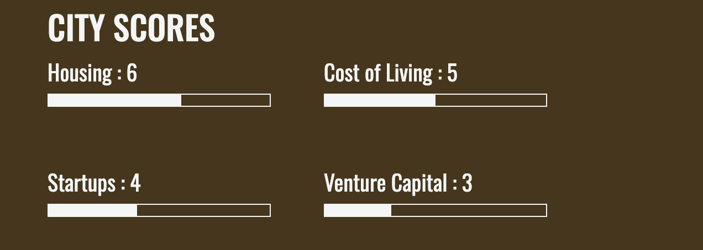

# Find the best city for you
Have you ever been curious about what is the cost of living in the city of your dreams? About housing situation? Safety? With this webpage you only need to type the name of a city and you'll see all the previous data and more.
 
 
Try the website <a href= "https://find-your-dream-city.netlify.app">here</a>.
 
Or continue reading about the project <a href= "#the-project">here</a>.

    
Index

    <ol>
        <li>
            <a href="#the-project">The Project</a>
            <ul>
                <li><a href="#prerequisite">Prerequisite</a></li>
                <li><a href="#technical-requisite">Technical requisite</a></li>
            </ul>
        </li>
        <!-- -->
        <li>
            <a href="#design-inspiration">Design inspiration</a>
        </li>
        <!--  -->
        <li>
            <a href="#coding">Coding</a>
            <ul>
                <li><a href="#languages">Languages</a></li>
                <li><a href="#libraries">Libraries</a></li>
                <li><a href="#bundler">Bundler</a></li>
                <li><a href="#free-api">Free API</a></li>
            </ul>
        </li>
        <!-- -->
        <li>
            <a href="#a-quick-guide-to-use">A quick guide to use</a>
            <ul>
                <li><a href="#search-for-the-city">Search for the city</a></li>
                <li><a href="#press-search-button-and-done">Press search button and... Done!</a></li>
            </ul>
        </li>
        <!--  -->
        <li><a href="#contacts">Contacts</a></li>
    </ol>

## The project
This project is part of my journey in learning to code with [Start2Impact University](https://www.start2impact.it). This is my second project with JavaScript language, and concludes JavaScript Advanced unity.
 
Created in 2023.

### Prerequisite
The assignment for this project was to built a website with a searchbar. If the user writes the name of a city inside this searchbar it will appear data about the quality of life in this city.
 
All the information were provided by [Teleport](https://developers.teleport.org/api/).

### Technical requisite 
- App must be developed with JavaScript
    - Javascript external libraries are recommended, but not mandatory
    - Upload the website using GitHub
    - Using Webpack
    - Write a complete README file
- Addictional features are welcome

<a href="#top">return to the top</a>

## Design inspiration 
I'm not a good graphic designer, so part of my preparatory work consist of search for inspirational works. For this project i have 2 main source:
- The work of a colleage in the Start2Impact University course you can see [here](https://github.com/cristopherturazza/S2I-JS-Advanced/tree/main#best-cities-to-live-house_with_garden) by clicking the link in the readme file. I really like the clear design of it, expecially the upper part of the website with the city photo.
- It was a pure coincidence, but soon after I had seen my colleague project I visited the [Teleport](https://developers.teleport.org/api/) website to examine the API information. I noticed the structure of the two website were similar, but i liked more the subdivision of the spaces in two column of teleport website.

<a href="#top">return to the top</a>

## Coding
To developed this website I used:

### Languages
- HTML
- CSS
- [Bootstrap 5](https://getbootstrap.com)
- [SASS](https://sass-lang.com)
- JavaScript

### Libraries
* [Lodash](https://lodash.com/docs/4.17.15#get)
* [Axios](https://axios-http.com/)

### Bundler
* [Webpack 5](https://webpack.js.org/)

### Free API
* [Teleport](https://developers.teleport.org/api/)

<a href="#top">return to the top</a>

## A quick guide to use
The website is really simple to use, but I'll illustrate an example to make the situation even clearer. 
First of all open the website [here](https://find-your-dream-city.netlify.app).

### Search for the city
In the upper part of the website you'll se a search-bar, simply type the name of the city you want to know more about.

For the sake of this example we'll search for Edinburgh.
Don't worry about making typos, the autocomplete system is here to help you. Just click on the name of the city when it'll show up.

### Press search button and... Done!
Once the name is fully written in the searchbar press the search button and you'll see the result, easy and quick!
Let's take a look at our result for completeness.
In the upper part of the screen you'll see an image of the city you've searched.

Lowering the gaze you can see a description box with city name, the country it belongs to and a brief description of the city.

At the left of the screen you can also see a bunch of scores (like the one in photo) useful to evaluate the city. The result is rounded up to the nearest number in a scale from 1 to 10.

And that's it, you can obtain this data for every city in the database.

<a href="#top">return to the top</a>

## Contacts
If you are intrested you can see all my works on my <a href= "https://francesca-pizzighini.github.io/Portfolio/projects.html">portfolio</a>, or you can visit my GitHub Repository [here](https://github.com/francesca-pizzighini).

Feel free to contact me if you have any question/curiosity about my work. You can do it through my <a href= "https://www.linkedin.com/in/francesca-pizzighini-20b4061b0">LinkedIn Profile</a> or in the contact page of my portfolio [here](https://francesca-pizzighini.github.io/Portfolio/contacts.html).

<a href="#top">return to the top</a>

